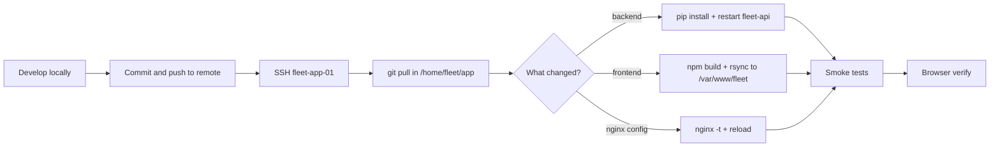

# Production update — push, pull, redeploy

Repeatable flow for shipping code changes to **fleet-app-01** (`192.168.135.21`) and serving them at **`https://fleet.gtiholding.com`**.

**Related:** initial install [`PRODUCTION_DEPLOYMENT_RUNBOOK.md`](PRODUCTION_DEPLOYMENT_RUNBOOK.md) · domain/env [`PRODUCTION_DOMAIN.md`](PRODUCTION_DOMAIN.md)

---

## Server layout (reference)

| Path | Purpose |
|------|---------|
| `/home/fleet/app` | Git clone (source) |
| `/home/fleet/app/backend` | FastAPI + `.venv` + **`.env`** (not in git) |
| `/home/fleet/app/frontend/build` | CRA/Craco build output |
| `/var/www/fleet` | Nginx docroot (published static files) |
| `127.0.0.1:8000` | `fleet-api` (Gunicorn) — internal only |
| **443 / 80** | Nginx — public UI + `/api` proxy |

**Production URL triple** (must stay aligned):

```text
CORS_ORIGINS=https://fleet.gtiholding.com
FRONTEND_URL=https://fleet.gtiholding.com
REACT_APP_BACKEND_URL=https://fleet.gtiholding.com   # build-time only
```

---

## Overview



---

## Part 1 — On your workstation

### 1.1 Develop and test locally

```bash
# Backend (repo root)
cd backend
source .venv/bin/activate   # or python3.11 -m venv .venv
uvicorn server:app --reload --host 0.0.0.0 --port 8000

# Frontend (separate terminal)
cd frontend
npm run dev
```

Confirm login, key pages, and API calls against local Mongo (or a dev DB).

### 1.2 Review what will deploy

```bash
git status
git diff
```

**Do not commit:**

- `backend/.env`, `frontend/.env` (secrets / local URLs)
- Credentials, tokens, or one-off test data

### 1.3 Commit and push

Use your team’s branch policy (example: `main` for production):

```bash
git add <files>
git commit -m "Short description of why (not just what)"
git push origin main
```

If you use **pull requests**, merge to the branch the server tracks before pulling on the server.

---

## Part 2 — On the server (`fleet-app-01`)

SSH as **`fleet`** (or your deploy user):

```bash
ssh fleet@192.168.135.21
# or: ssh fleet@fleet-app-01
cd /home/fleet/app
```

### 2.1 Pull latest code

```bash
cd /home/fleet/app
git fetch origin
git status
git pull origin main
```

If the pull reports local changes on the server, **do not** blindly overwrite `backend/.env`. Stash or discard only tracked files you intend to reset:

```bash
git stash push -m "server local" -- backend/.env   # if you ever copied .env into git by mistake — prefer never tracking it
git pull origin main
```

> **Rule:** `backend/.env` lives only on the server. `git pull` must **not** replace production secrets. If `.env.example` changed, merge new keys **manually** into `/home/fleet/app/backend/.env`.

### 2.2 Backend update (when `backend/` or `requirements.txt` changed)

```bash
cd /home/fleet/app/backend
source .venv/bin/activate
pip install --upgrade pip wheel
pip install -r requirements.txt
deactivate

sudo systemctl restart fleet-api
sudo systemctl status fleet-api --no-pager
```

Quick API check:

```bash
curl -sS http://127.0.0.1:8000/health
```

**If you only changed Python code** and `requirements.txt` is unchanged, **restart is enough** (skip `pip install`).

**If you changed `backend/.env`** (CORS, `FRONTEND_URL`, Mongo, secrets):

```bash
chmod 600 /home/fleet/app/backend/.env
sudo systemctl restart fleet-api
```

If `CORS_ORIGINS` or public URL changed, you must also **rebuild the frontend** (Part 2.3).

### 2.3 Frontend update (when `frontend/` changed)

`REACT_APP_BACKEND_URL` is **baked in at build time**. Production value:

```bash
cd /home/fleet/app/frontend
export REACT_APP_BACKEND_URL="https://fleet.gtiholding.com"
npm ci
npm run build
```

Publish to Nginx docroot:

```bash
sudo rsync -a /home/fleet/app/frontend/build/ /var/www/fleet/
sudo chown -R nginx:nginx /var/www/fleet
sudo chmod -R a+rX /var/www/fleet
```

**If you only changed backend** and did not touch React, **skip** this section.

> Runbook E2 may use **Yarn** (`yarn install --frozen-lockfile && yarn build`). **npm** is fine if that is what you already use on the server — stay consistent with one tool per environment.

### 2.4 Nginx (only when config changed)

If you edited `/etc/nginx/conf.d/fleet.conf` or TLS files:

```bash
sudo nginx -t
sudo systemctl reload nginx
```

Normal app deploys **do not** require an Nginx reload.

---

## Part 3 — Verify updates are live

### 3.1 Command-line smoke tests

```bash
curl -sS http://127.0.0.1:8000/health
curl -sS -o /dev/null -w "%{http_code}\n" https://fleet.gtiholding.com/
curl -sS -o /dev/null -w "%{http_code}\n" https://fleet.gtiholding.com/api/auth/me
```

Expected: health JSON; `/` → **200**; `/api/auth/me` → **401** without a token.

### 3.2 Browser

1. Open **https://fleet.gtiholding.com**
2. Hard refresh if needed: **Ctrl+Shift+R** (Windows/Linux) or **Cmd+Shift+R** (Mac)  
   CRA builds use hashed JS/CSS filenames, so a normal deploy usually busts cache automatically.
3. Exercise the feature you changed (login, dashboard, forms).

### 3.3 Logs (if something fails)

```bash
sudo journalctl -u fleet-api -n 80 --no-pager
sudo tail -n 50 /var/log/fleet/error.log
sudo tail -n 50 /var/log/nginx/error.log
```

---

## Quick reference — what to run

| Change type | Actions on server |
|-------------|-------------------|
| **Frontend only** | `git pull` → `npm ci && npm run build` → `rsync` to `/var/www/fleet` |
| **Backend only** | `git pull` → `pip install -r requirements.txt` (if deps changed) → `restart fleet-api` |
| **Both** | Backend steps, then frontend build + `rsync` |
| **Env / URL change** | Edit `backend/.env` → restart API → **rebuild frontend** with matching `REACT_APP_BACKEND_URL` |
| **Nginx / TLS** | Edit config or certs → `nginx -t` → `reload nginx` |

---

## One-shot deploy script (optional)

Run on **`fleet-app-01`** as **`fleet`** after `git pull`. Adjust branch and package manager if needed.

```bash
set -euo pipefail
APP=/home/fleet/app
export REACT_APP_BACKEND_URL="https://fleet.gtiholding.com"

cd "$APP/backend"
source .venv/bin/activate
pip install -r requirements.txt -q
deactivate
sudo systemctl restart fleet-api

cd "$APP/frontend"
npm ci
npm run build
sudo rsync -a "$APP/frontend/build/" /var/www/fleet/
sudo chown -R nginx:nginx /var/www/fleet

curl -sS http://127.0.0.1:8000/health
echo "Deploy done — verify https://fleet.gtiholding.com"
```

Save as e.g. `/home/fleet/bin/deploy-fleet.sh`, `chmod +x`, and run after each pull. Split into “backend-only” / “frontend-only” flags if you prefer smaller restarts.

---

## Rollback

If the new version is broken:

```bash
cd /home/fleet/app
git log -5 --oneline
git checkout <previous-good-commit-or-tag>
```

Then repeat **backend restart** and/or **frontend build + rsync** for that revision.

For database migrations (if you add them later), plan rollback separately — `git checkout` does not undo MongoDB changes.

---

## Pitfalls

| Symptom | Likely cause | Fix |
|---------|----------------|-----|
| UI old, API new (or vice versa) | Only half of deploy ran | Run both 2.2 and 2.3 as needed |
| API calls to `:8000` from browser | Wrong `REACT_APP_BACKEND_URL` at build | Rebuild with `https://fleet.gtiholding.com` (no port) |
| CORS errors | `CORS_ORIGINS` ≠ browser origin | Set `https://fleet.gtiholding.com` in `backend/.env`, restart API |
| `git pull` conflicts | Edits made directly on server | Resolve conflicts; avoid editing tracked files on prod except `.env` |
| `Permission denied` on rsync | Need sudo for `/var/www/fleet` | Use `sudo rsync` + `chown nginx:nginx` |
| Service won’t start | Bad `.env` or missing dependency | `journalctl -u fleet-api`; fix `.env`; `pip install -r requirements.txt`/` |

---

## Checklist (copy per release)

**Workstation**

- [ ] Tested locally
- [ ] No secrets in commit
- [ ] Pushed to remote / merged to deploy branch

**Server (`fleet-app-01`)**

- [ ] `git pull` in `/home/fleet/app`
- [ ] `pip install` if `requirements.txt` changed
- [ ] `sudo systemctl restart fleet-api`
- [ ] `npm run build` with `REACT_APP_BACKEND_URL=https://fleet.gtiholding.com`
- [ ] `rsync` build → `/var/www/fleet`
- [ ] `curl` health + HTTPS `/`
- [ ] Browser check on https://fleet.gtiholding.com

**MongoDB nodes (`.22` / `.23`)** — only when DB config or mongod changes; normal app deploys **do not** require pulls on DB servers.
